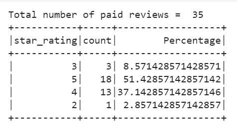
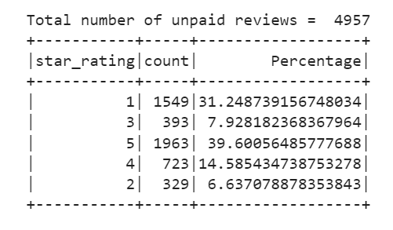

# Amazon_Vine_Analysis
Amazon Vine Analysis using ETL, AWS RDS, PgAdmin PostgreSQL, PySpark

### Project Overiview

## Background

The client Selby is about to release a large catalogue of products on a leading retail website. They want to know how the reviews of their products compare with the reviews of similar products sold at their competitors. They are also interested in enrolling in a program that gives out free products to select reviewers, but they want to know if its worth the cost. 
There are thousands of reviews, and they are in words not numbers so they need to be translateed first in order to analyze them. As a Big Data expert specializing in helping business optimize their marketing effort, hefty analytics will be performed for a client.    

## Purpose

Analyzing Amazon reviews written by members of the paid Amazon Vine program. The Amazon Vine program is a service that allows manufacturers and publishers to receive reviews for their products. Companies like SellBy pay a small fee to Amazon and provide products to Amazon Vine members, who are then required to publish a review.
- Perform ETL on Amazon Product Reviews
- Determine Bias of Vine Reviews

## Resources:

- SQL table schema  [challenge_schema.sql](challenge_schema.sql)
- The Amazon Review datasets  https://s3.amazonaws.com/amazon-reviews-pds/tsv/index.txt contains about 50 datasets that contains reviews of a specific product, from clothing apparel to wireless products.  For this analysis the following dataset has been selected: https://s3.amazonaws.com/amazon-reviews-pds/tsv/amazon_reviews_us_Major_Appliances_v1_00.tsv.gz
	
Tools: Used PySpark to perform the ETL process to extract the dataset, transform the data, connect to an AWS RDS instance, and load the transformed data into pgAdmin (PostgreSQL)
	
### Perform ETL on Amazon Product Reviews

Analysis:Using PySpark notebook and AWS RDS [Amazon_Reviews_ETL_1.ipynb](Amazon_Reviews_ETL_1.ipynb)

- Create an AWS RDS database with tables in pgAdmin 
- Extract the selected dataset into a DataFrame 
- Transform the DataFrame into four separate DataFrames that match the table schema in pgAdmin 
- Upload the transformed data into the appropriate tables and run queries in pgAdmin to confirm that the data has been uploaded.

### Determine Bias of Vine Reviews

Determined if there is any bias toward favorable reviews from Vine members in your dataset using PySpark [Vine_Review_Analysis.ipynb](Vine_Review_Analysis.ipynb)

Paid Reviews Summary:

Unpaid Reviews Summary:

### Summary

For Major Appliances, there were a total of 35 paid reviews of which 51% (18) were 5-star reviews. For the same category, there were a total of 4957 unpaid reviews of which 39% (1963) were 5-star reviews. 

There is a bias towards paid reviews in the 5-star category. In addition to that, the data shows that 88% of the total paid reviews were given either a 4-star or a 5-star rating, while no paid review was given a 1-star rating.   